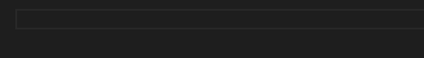

# React Hooks Snippets for Visual Studio Code

> The React Hooks API is currently _experimental_. See https://reactjs.org/hooks for more information.

## Features

This extension contributes a few handy snippet for the [useState hook](https://reactjs.org/docs/hooks-reference.html#usestate).

The second placeholder value is automatically capitalized on <kbd>Tab</kbd>.

In addition, there are a few variations with common initial state values:

| Snippet | Purpose           |
| ------- | ----------------- |
| `us`    | `useState()`      |
| `usf`   | `useState(false)` |
| `ust`   | `useState(true)`  |
| `usn`   | `useState(null)`  |

## Requirements

Visual Studio Code 1.25.1 or higher.

## "What about the other hooks?"

TBD. After all, Hooks are not officially released yet.

## "I prefer `let` over `const`."

It's easy enough to [create your own snippet](https://code.visualstudio.com/docs/editor/userdefinedsnippets#_creating-your-own-snippets) in VS Code! You can use [this gist](https://gist.github.com/antmdvs/63903d7f98f8d82d0c6463abebb77cd7) as a starting point.

---
